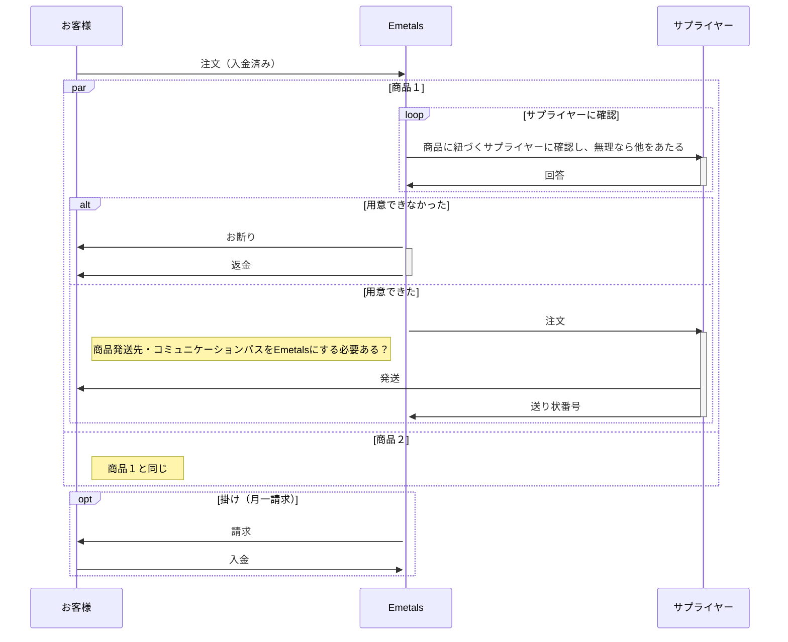

# test_e-metals
テスト
リポジトリ

```mermaid
sequenceDiagram
	お客様->>Emetals:注文（入金済み）
	par 商品１
		loop サプライヤーに確認
			Emetals->>サプライヤー:商品に紐づくサプライヤーに確認し、無理なら他をあたる
			activate サプライヤー
			サプライヤー->>Emetals:回答
			deactivate　サプライヤー
		end
		alt 用意できなかった
			activate Emetals
			Emetals->>お客様: お断り
			activate Emetals
			Emetals->>お客様: 返金
			deactivate　Emetals
		else 用意できた
			Emetals->>サプライヤー: 注文
			activate サプライヤー
			Note right of お客様: 商品発送先・コミュニケーションパスをEmetalsにする必要ある？
			サプライヤー->>お客様: 発送
			サプライヤー->>Emetals: 送り状番号
			deactivate　サプライヤー
		end
	and 商品２
		Note right of お客様: 商品１と同じ
	end
	opt 掛け（月一請求）
		Emetals->>お客様: 請求
		お客様->>Emetals: 入金
	end
```
